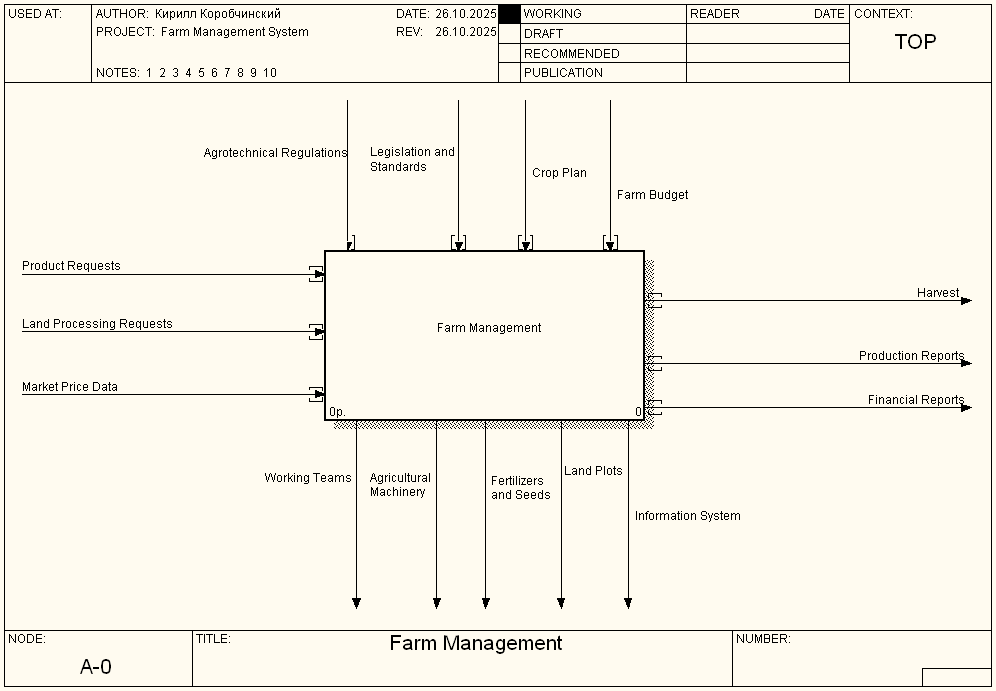
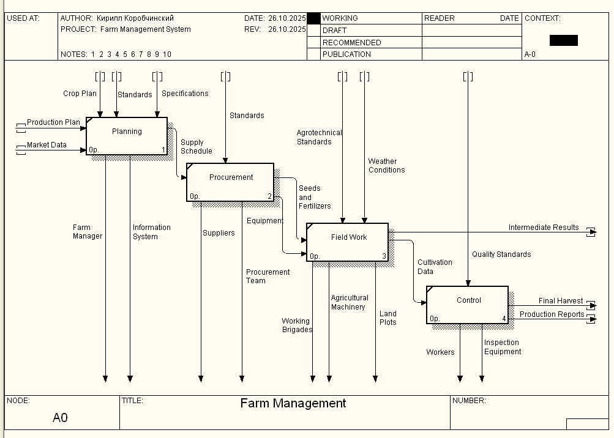
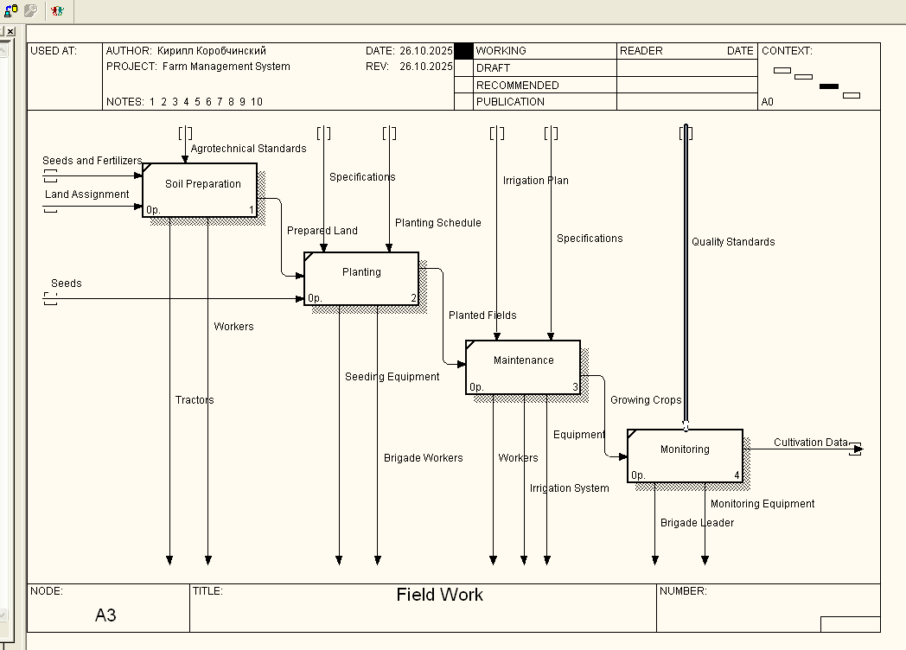

# Практична робота №3
## CASE-засоби моделювання бізнес-процесів ІС, методологія IDEF0

**Виконавець:** Шевченко А.А., група КС-21  
**Дата:** 26.10.2025

---

## Мета роботи

Набути досвіду створення IDEF0-моделі бізнес-процесів за допомогою CASE-засобів BPWin.

---

## Завдання

Створити IDEF0-модель системи управління фермою, яка включає:
- Управління земельними ділянками
- Управління робочими бригадами
- Управління сільськогосподарською технікою
- Планування та облік врожайності
- Облік добрив та агротехнічних операцій

---

## Властивості моделі

### Model Properties

**Purpose:** Моделювання процесів управління фермою для оптимізації використання ресурсів та підвищення врожайності

**Viewpoint:** Директор ферми

**Definition:** Модель описує діяльність ферми, включаючи управління ділянками, культурами, бригадами та технікою

---

## Контекстна діаграма А-0



### Елементи діаграми:

**Входи (Input):**
- Product Requests - запити на виробництво продукції
- Land Processing Requests - запити на обробку земельних ділянок
- Market Price Data - дані про ринкові ціни

**Управління (Control):**
- Agrotechnical Regulations - агротехнічні регламенти
- Legislation and Standards - законодавство та стандарти
- Crop Plan - план посівів
- Farm Budget - бюджет ферми

**Виходи (Output):**
- Harvest - врожай
- Production Reports - виробничі звіти
- Financial Reports - фінансові звіти

**Механізми (Mechanism):**
- Working Teams - робочі бригади
- Agricultural Machinery - сільськогосподарська техніка
- Fertilizers and Seeds - добрива та насіння
- Land Plots - земельні ділянки
- Information System - інформаційна система

---

## Діаграма декомпозиції А0



Діаграма декомпозиції включає основні підпроцеси управління фермою.

---

## Діаграма декомпозиції А3 - Field Work



Діаграма A3 деталізує процес "Field Work" (Польові роботи) та включає чотири основні підпроцеси:

### Підпроцеси:
1. **Soil Preparation** - Підготовка ґрунту до посадки
2. **Planting** - Посадка культур
3. **Maintenance** - Догляд за посівами (зрошення, внесення добрив)
4. **Monitoring** - Моніторинг росту та збір даних

### Потоки даних:
- **Входи:** насіння, добрива, розподіл земель, графіки посадки
- **Управління:** агротехнічні стандарти, специфікації, план зрошення
- **Виходи:** підготовлені ділянки, засаджені поля, дані моніторингу
- **Механізми:** робітники, техніка, бригадири, системи зрошення

Діаграма показує послідовність виконання польових робіт від підготовки ґрунту до моніторингу врожаю.

---

## Звіти BPWin

### Model Report

Model Name: Farm Operations Model
Definition: This model represents the complete farm management system including land plots management, crop cultivation, brigade coordination, and equipment utilization
Scope: Farm with multiple land plots, brigades, agricultural machinery, and crop production cycle
Viewpoint: Farm Manager
Time Frame: (AS-IS)
Status: WORKING
Purpose: To model and optimize farm management processes including land cultivation, crop planning, and resource allocation
Author Name: Кирилл Коробчинский
Creation Date: 26.10.2025
System Last Revision Date: 26.10.2025
User Last Revision Date: 26.10.2025


### Diagram Report
Report for Diagram: A0, Farm Management 


Activity Name: Planning 
Activity Status: WORKING
Activity Author: Кирилл Коробчинский
Object Type: Activity
Activity Number: A1

Activity Name: Procurement  
Activity Status: WORKING
Activity Author: Кирилл Коробчинский
Object Type: Activity
Activity Number: A2

Activity Name: Field Work
Activity Status: WORKING
Activity Author: Кирилл Коробчинский
Object Type: Activity
Activity Number: A3

Activity Name: Control
Activity Status: WORKING
Activity Author: Кирилл Коробчинский
Object Type: Activity
Activity Number: A4

Link Name: Crop Plan
Link Author: Кирилл Коробчинский

Link Name: Production Reports
Link Author: Кирилл Коробчинский

Link Name: Agricultural Machinery
Link Author: Кирилл Коробчинский

Link Name: Land Plots
Link Author: Кирилл Коробчинский

Link Name: Information System
Link Author: Кирилл Коробчинский

Link Name: Workers
Link Author: Кирилл Коробчинский

Link Name: Inspection Equipment
Link Author: Кирилл Коробчинский

Link Name: Final Harvest
Link Author: Кирилл Коробчинский

Link Name: Quality Standards
Link Author: Кирилл Коробчинский

Link Name: Cultivation Data
Link Author: Кирилл Коробчинский

Link Name: Working Brigades
Link Author: Кирилл Коробчинский

Link Name: Intermediate Results
Link Author: Кирилл Коробчинский

Link Name: Agrotechnical Standards
Link Author: Кирилл Коробчинский

Link Name: Weather Conditions
Link Author: Кирилл Коробчинский

Link Name: Seeds and Fertilizers
Link Author: Кирилл Коробчинский

Link Name: Equipment
Link Author: Кирилл Коробчинский

Link Name: Suppliers
Link Author: Кирилл Коробчинский

Link Name: Procurement Team
Link Author: Кирилл Коробчинский

Link Name: Standards
Link Author: Кирилл Коробчинский

Link Name: Supply Schedule
Link Author: Кирилл Коробчинский

Link Name: Farm Manager
Link Author: Кирилл Коробчинский

Link Name: Specifications
Link Author: Кирилл Коробчинский

Link Name: Market Data
Link Author: Кирилл Коробчинский

Link Name: Production Plan
Link Author: Кирилл Коробчинский


### Arrow Report

Arrow Name: Agricultural Machinery
Arrow Dest.: Farm Management  + Field Work
Arrow Dest. Type: Call Arrow + Call Arrow

Arrow Name: Agrotechnical Regulations
Arrow Source: { Border }
Arrow Source Type: Control
Arrow Dest.: Farm Management 
Arrow Dest. Type: Control

Arrow Name: Agrotechnical Standards
Arrow Source: { Tunnel } + { Tunnel }
Arrow Source Type: Control + Control
Arrow Dest.: Field Work + Soil Preparation 
Arrow Dest. Type: Control + Control

Arrow Name: Brigade Leader
Arrow Dest.: Monitoring 
Arrow Dest. Type: Call Arrow

Arrow Name: Brigade Workers
Arrow Dest.: Planting  
Arrow Dest. Type: Call Arrow

Arrow Name: Crop Plan
Arrow Source: { Border } + { Tunnel }
Arrow Source Type: Control + Control
Arrow Dest.: Farm Management  + Planning 
Arrow Dest. Type: Control + Control

Arrow Name: Cultivation Data
Arrow Source: Field Work + Monitoring 
Arrow Source Type: Output + Output
Arrow Dest.: Control + { Tunnel }
Arrow Dest. Type: Input + Output

Arrow Name: Equipment
Arrow Source: Procurement  
Arrow Source Type: Output
Arrow Dest.: Field Work + Maintenance  
Arrow Dest. Type: Mechanism + Call Arrow

Arrow Name: Farm Budget
Arrow Source: { Border }
Arrow Source Type: Control
Arrow Dest.: Farm Management 
Arrow Dest. Type: Control

Arrow Name: Farm Manager
Arrow Dest.: Planning 
Arrow Dest. Type: Call Arrow

Arrow Name: Fertilizers and Seeds
Arrow Dest.: Farm Management 
Arrow Dest. Type: Call Arrow

Arrow Name: Final Harvest
Arrow Source: Control
Arrow Source Type: Output
Arrow Dest.: { Tunnel }
Arrow Dest. Type: Output

Arrow Name: Financial Reports
Arrow Source: Farm Management 
Arrow Source Type: Output
Arrow Dest.: { Border }
Arrow Dest. Type: Output

Arrow Name: Growing Crops
Arrow Source: Maintenance  
Arrow Source Type: Output
Arrow Dest.: Monitoring 
Arrow Dest. Type: Input

Arrow Name: Harvest
Arrow Source: Farm Management 
Arrow Source Type: Output
Arrow Dest.: { Border }
Arrow Dest. Type: Output

Arrow Name: Information System
Arrow Dest.: Farm Management  + Planning 
Arrow Dest. Type: Call Arrow + Call Arrow

Arrow Name: Inspection Equipment
Arrow Dest.: Control
Arrow Dest. Type: Call Arrow

Arrow Name: Intermediate Results
Arrow Source: Field Work
Arrow Source Type: Output
Arrow Dest.: Control
Arrow Dest. Type: Input

Arrow Name: Irrigation Plan
Arrow Source: { Tunnel }
Arrow Source Type: Control
Arrow Dest.: Maintenance  
Arrow Dest. Type: Control

Arrow Name: Irrigation System
Arrow Dest.: Maintenance  
Arrow Dest. Type: Call Arrow

Arrow Name: Land Assignment
Arrow Source: { Tunnel }
Arrow Source Type: Input
Arrow Dest.: Soil Preparation 
Arrow Dest. Type: Input

Arrow Name: Land Plots
Arrow Dest.: Farm Management  + Field Work
Arrow Dest. Type: Call Arrow + Call Arrow

Arrow Name: Land Processing Requests
Arrow Source: { Border }
Arrow Source Type: Input
Arrow Dest.: Farm Management 
Arrow Dest. Type: Input

Arrow Name: Legislation and Standards
Arrow Source: { Border }
Arrow Source Type: Control
Arrow Dest.: Farm Management 
Arrow Dest. Type: Control

Arrow Name: Market Data
Arrow Source: { Tunnel }
Arrow Source Type: Input
Arrow Dest.: Planning 
Arrow Dest. Type: Input

Arrow Name: Market Price Data
Arrow Source: { Border }
Arrow Source Type: Input
Arrow Dest.: Farm Management 
Arrow Dest. Type: Input

Arrow Name: Monitoring Equipment
Arrow Dest.: Monitoring 
Arrow Dest. Type: Call Arrow

Arrow Name: Planted Fields
Arrow Source: Planting  
Arrow Source Type: Output
Arrow Dest.: Maintenance  
Arrow Dest. Type: Input

Arrow Name: Planting Schedule
Arrow Source: { Tunnel }
Arrow Source Type: Control
Arrow Dest.: Planting  
Arrow Dest. Type: Control

Arrow Name: Prepared Land
Arrow Source: Soil Preparation 
Arrow Source Type: Output
Arrow Dest.: Planting  
Arrow Dest. Type: Input

Arrow Name: Procurement Team
Arrow Dest.: Procurement  
Arrow Dest. Type: Call Arrow

Arrow Name: Product Requests
Arrow Source: { Border }
Arrow Source Type: Input
Arrow Dest.: Farm Management 
Arrow Dest. Type: Input

Arrow Name: Production Plan
Arrow Source: { Tunnel }
Arrow Source Type: Input
Arrow Dest.: Planning 
Arrow Dest. Type: Input

Arrow Name: Production Reports
Arrow Source: Farm Management  + Control
Arrow Source Type: Output + Output
Arrow Dest.: { Border } + { Tunnel }
Arrow Dest. Type: Output + Output

Arrow Name: Quality Standards
Arrow Source: { Tunnel } + { Tunnel }
Arrow Source Type: Control + Control
Arrow Dest.: Control + Monitoring 
Arrow Dest. Type: Control + Control

Arrow Name: Seeding Equipment
Arrow Dest.: Planting  
Arrow Dest. Type: Call Arrow

Arrow Name: Seeds
Arrow Source: { Tunnel }
Arrow Source Type: Input
Arrow Dest.: Planting  
Arrow Dest. Type: Input

Arrow Name: Seeds and Fertilizers
Arrow Source: Procurement   + { Tunnel }
Arrow Source Type: Output + Input
Arrow Dest.: Field Work + Soil Preparation 
Arrow Dest. Type: Input + Input

Arrow Name: Specifications
Arrow Source: { Tunnel } + { Tunnel } + { Tunnel }
Arrow Source Type: Control + Control + Control
Arrow Dest.: Planning  + Planting   + Maintenance  
Arrow Dest. Type: Control + Control + Control

Arrow Name: Standards
Arrow Source: { Tunnel } + { Tunnel }
Arrow Source Type: Control + Control
Arrow Dest.: Planning  + Procurement  
Arrow Dest. Type: Control + Control

Arrow Name: Suppliers
Arrow Dest.: Procurement  
Arrow Dest. Type: Call Arrow

Arrow Name: Supply Schedule
Arrow Source: Planning 
Arrow Source Type: Output
Arrow Dest.: Procurement  
Arrow Dest. Type: Input

Arrow Name: Tractors
Arrow Dest.: Soil Preparation 
Arrow Dest. Type: Call Arrow

Arrow Name: Weather Conditions
Arrow Source: { Tunnel }
Arrow Source Type: Control
Arrow Dest.: Field Work
Arrow Dest. Type: Control

Arrow Name: Workers
Arrow Dest.: Control + Soil Preparation  + Maintenance  
Arrow Dest. Type: Call Arrow + Call Arrow + Call Arrow

Arrow Name: Working Brigades
Arrow Dest.: Field Work
Arrow Dest. Type: Call Arrow

Arrow Name: Working Teams
Arrow Dest.: Farm Management 
Arrow Dest. Type: Call Arrow


### Model Consistency ReportModel Inconsistencies:
 
Diagram A0:  Farm Management 
    has 15 unresolved (square tunneled) arrow connections:
        Border Source: Production Plan
        Border Source: Market Data
        Source: Cultivation Data
        Sink: Seeds and Fertilizers
        Source: Intermediate Results
        Border Sink: Final Harvest
        Border Sink: Production Reports
        Border Source: Crop Plan
        Border Source: Standards
        Border Source: Specifications
        Border Source: Standards
        Sink: Equipment
        Border Source & Sink: Agrotechnical Standards
        Border Source & Sink: Weather Conditions
        Border Source: Quality Standards
 
Diagram A-0:  Farm Management 
    has 10 unresolved (square tunneled) arrow connections:
        Sink: Product Requests
        Source: Harvest
        Sink: Land Processing Requests
        Source: Production Reports
        Sink: Market Price Data
        Source: Financial Reports
        Sink: Agrotechnical Regulations
        Sink: Legislation and Standards
        Sink: Crop Plan
        Sink: Farm Budget
 
Diagram A3:  Field Work
    has 10 unresolved (square tunneled) arrow connections:
        Border Source: Seeds and Fertilizers
        Border Source: Land Assignment
        Border Source: Seeds
        Border Sink: Cultivation Data
        Border Source: Agrotechnical Standards
        Border Source: Specifications
        Border Source: Planting Schedule
        Border Source: Irrigation Plan
        Border Source: Specifications
        Border Source: Quality Standards

---

## Структура файлів
```
Lab3/
├── README.md
├── Farm_Management_Shevchenko_A_A.bp1
├── context_diagram_A0.png
├── decomposition_A0.png
├── field_work_A3.png          
```

---

## Висновки

У ході виконання практичної роботи було створено IDEF0-модель системи управління фермою за допомогою BPWin. Освоєно принципи побудови контекстних діаграм та діаграм декомпозиції відповідно до методології IDEF0. Згенеровано необхідні звіти для документування та перевірки узгодженості моделі.

Створена модель може використовуватися для подальшого проектування інформаційної системи управління сільськогосподарським підприємством.

---

## Посилання

- [Конспект лекцій](https://docs.google.com/document/d/1Ugped4A2_HVfekMeNFSazkbyiOyubYB4vJDXcnRIavY/edit?usp=sharing)
