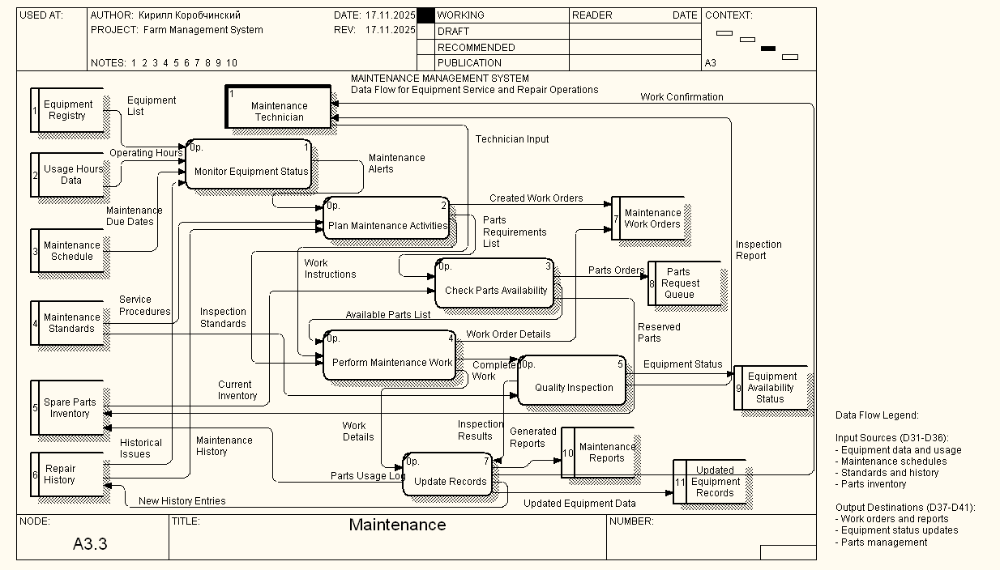

# Лабораттонра робота №4: CASE-засоби моделювання бізнес-процесів

## Загальна інформація

**Тема:** CASE-засоби моделювання бізнес-процесів ІС, методологія IDEF3 та DFD

**Мета:** Набути досвіду створення DFD та IDEF3 моделей бізнес-процесів за допомогою CASE-засобів BPWin

**Виконавець:** Шевченко А.А., студентка 2 курсу групи КС-21  
**Спеціальність:** 122 «Комп'ютерні науки»  
**Університет:** Харківський національний університет імені В.Н. Каразіна

---

## Постановка задачі

### Предметна область: Управління фермерським господарством

На фермі є кілька ділянок землі з унікальними номерами. Система повинна враховувати:

**Ділянки землі:**
- Площа
- Наявність/відсутність зрошення
- Посіяна культура в поточному сезоні
- Перелік внесених добрив

**Культури:**
- Назва
- Врожайність по ділянках
- Потреба в зрошенні
- Необхідні добрива

**Бригади:**
- Унікальний номер
- ПІБ бригадира
- Список працівників
- Кількість одиниць сільгосптехніки

**Працівники:**
- ПІБ
- Кваліфікація (якими видами техніки може керувати)

### Функціональні вимоги

**Запити:**
- Визначити площу під культури
- Вивести робітників бригади з технікою
- Знайти культуру з максимальною врожайністю
- Знайти бригади з технікою понад середню
- Скласти список ділянок з невідповідними добривами

**Транзакції:**
- Купити техніку
- Найняти/звільнити працівників

---

## Виконані завдання

### Завдання 1: Діаграма IDEF3 "Soil Preparation"


**Опис процесу підготовки ґрунту:**

Процес складається з наступних основних етапів:

1. **Аналітична фаза:**
   - Start Soil Analysis (Op.26)
   - Collect Soil Sample (Op.27)
   - Analyze Soil Composition (Op.28)

2. **Адаптивна обробка (J2):**
   - Якщо якість недостатня → Apply Soil Treatment (Op.30)
   - Якщо якість задовільна → Clear Field of Debris (Op.29)

3. **Базова обробка:**
   - Perform Primary Tillage (Op.31)
   - Apply Fertilizers (Op.32)

4. **Зрошення (J1):**
   - За потреби → Install/Check Irrigation System (Op.34)
   - Без потреби → перехід до наступного етапу

5. **Фінальна підготовка:**
   - Perform Secondary Tillage (Op.33)
   - Level and Smooth Field (Op.35)
   - Perform Final Field Inspection (Op.36)

6. **Контроль якості (J4, J6):**
   - Документування даних (Op.37)
   - Виявлення проблем (Op.38)
   - Цикл повторного тестування при необхідності

**Ключові особливості:**
- Адаптивний підхід залежно від стану ґрунту
- Цикл контролю якості
- Врахування специфічних потреб культур
- Логічна послідовність операцій

---

### Завдання 2: Діаграма DFD "Maintenance"



**Опис системи обслуговування обладнання:**

**Зовнішні сутності:**
- Equipment Registry
- Maintenance Technician
- Inspection Standards
- Current Inventory
- Maintenance History
- Repair History

**Основні процеси:**

1. **Monitor Equipment Status (Op.1)**
   - Вхід: Equipment List, Operating Hours, Usage Hours Data
   - Вихід: Maintenance Alerts, Maintenance Due Dates

2. **Plan Maintenance Activities (Op.2)**
   - Центральний процес планування
   - Створює робочі накази та списки необхідних запчастин

3. **Check Parts Availability (Op.3)**
   - Перевірка наявності запчастин
   - Формування замовлень

4. **Perform Maintenance Work (Op.4)**
   - Виконання робіт з обслуговування
   - Логування використання запчастин

5. **Quality Inspection (Op.5)**
   - Контроль якості виконаних робіт
   - Генерація звітів

6. **Update Records (Op.6)**
   - Оновлення записів про обладнання

7. **Generate Maintenance Reports (Op.10)**
   - Створення підсумкових звітів

**Особливості системи:**
- Централізований моніторинг обладнання
- Планування на основі історичних даних
- Управління запчастинами
- Цикл зворотного зв'язку
- Система звітності

---

## Порівняльний аналіз моделей

### IDEF3 (Process Flow Description)
**Фокус на:**
- Послідовності виконання операцій
- Логіці прийняття рішень
- Часових залежностях
- Процесуальному аспекті

### DFD (Data Flow Diagram)
**Фокус на:**
- Потоках інформації
- Трансформації даних
- Сховищах даних
- Інформаційному аспекті

### Синергія моделей
Використання обох типів моделей разом забезпечує:
- Повне уявлення про бізнес-процес
- Основу для проєктування інформаційної системи
- Виявлення вузьких місць в процесах та потоках даних

---

## Структура репозиторію

```
Practice_4/
├── README.md                    # Цей файл
├── ЛР4_База_Даних_Шевченко_А.А_КС21.pdf   # Повний звіт
├── Lab4_Farm_Management_Shevchenko_A_A.bp1
├── IDEF3_Soil_Preparation.png
└── DFD_Maintenance.png
```

---

## Використані технології

- **BPWin** - CASE-засіб для моделювання бізнес-процесів
- **IDEF3** - методологія моделювання процесів
- **DFD** - методологія моделювання потоків даних

---

## Висновки

Побудовані моделі демонструють:
- Логічну структуру процесів
- Правильне використання нотацій
- Інтеграцію з іншими підсистемами
- Механізми контролю якості

**Практичне застосування:**
1. Розробка інформаційної системи управління фермерським господарством
2. Автоматизація процесів підготовки ґрунту та обслуговування техніки
3. Оптимізація бізнес-процесів
4. Планування ресурсів

**Отримані навички:**
- Моделювання бізнес-процесів в нотації IDEF3
- Створення діаграм потоків даних (DFD)
- Аналіз та оптимізація процесів
- Робота з CASE-засобом BPWin

---

## Посилання

- [Конспект/Словник лекцій]([https://docs.google.com/document/d/your-link](https://docs.google.com/document/d/1Ugped4A2_HVfekMeNFSazkbyiOyubYB4vJDXcnRIavY/edit?usp=sharing))
- [Повний репозиторій курсу](https://github.com/nnnsoor/Data_Bases_Shevchenko.A.A_KC21)

---

## Автор

**Шевченко Анастасія**  
Група КС-21  
Харківський національний університет імені В.Н. Каразіна  
2025 рік
