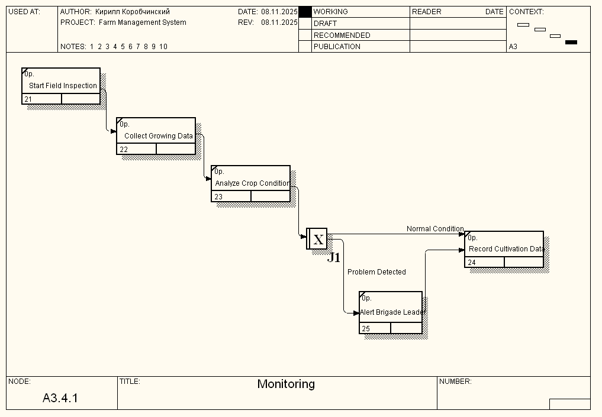
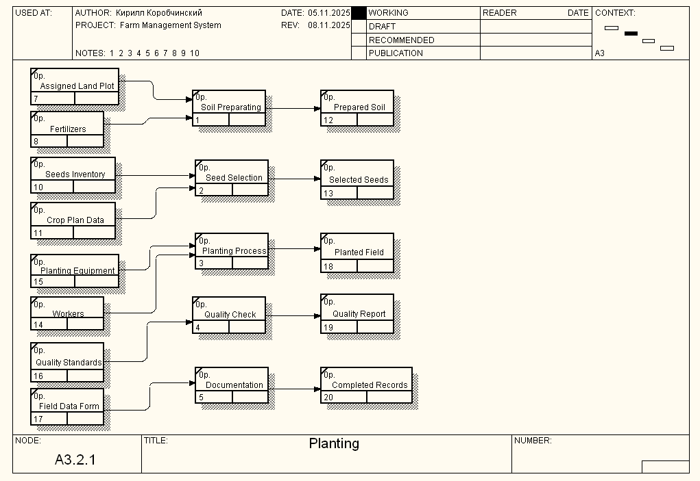

# Практична робота №4
## CASE-засоби моделювання бізнес-процесів ІС (IDEF3 та DFD)

**Виконала:** Шевченко А.А., група КС-21  
**Дата:** 08.11.2025

---

## Мета роботи

Набути досвіду створення DFD та IDEF3 моделей бізнес-процесів за допомогою CASE-засобів BPWin.

---

## Предметна область

**Система управління фермою (Farm Management System)**

На фермі є кілька ділянок землі з унікальними номерами. Кожна ділянка характеризується площею, наявністю зрошення, посіяною культурою. Кожну ділянку обслуговує одна бригада з унікальним номером, бригадиром, працівниками та технікою.

**Запити:** визначення площі під культури, виведення робітників бригади з технікою, пошук культури з максимальною врожайністю, пошук бригад з технікою понад середню, складання списку ділянок з невідповідними добривами.

**Транзакції:** купівля техніки, наймання/звільнення працівників.

---

## Контекстна діаграма А-0 (з ЛР3)


### Структура системи:

**Входи (Inputs):**
- Product Requests - запити на виробництво продукції
- Land Processing Requests - запити на обробку землі
- Market Price Data - ринкові дані про ціни

**Управління (Controls):**
- Agrotechnical Regulations - агротехнічні норми
- Legislation and Standards - законодавство та стандарти
- Crop Plan - план посівів
- Farm Budget - бюджет ферми

**Виходи (Outputs):**
- Harvest - врожай
- Production Reports - звіти про виробництво
- Financial Reports - фінансові звіти

**Механізми (Mechanisms):**
- Working Teams - робочі бригади
- Agricultural Machinery - сільгосптехніка
- Fertilizers and Seeds - добрива та насіння
- Land Plots - земельні ділянки
- Information System - інформаційна система

---

## Діаграма IDEF3: Monitoring Process Flow (A3.4.1)



### Опис процесу

Діаграма IDEF3 моделює процес моніторингу вирощування культур як послідовність дій у часі.

### Компоненти діаграми:

**UOB (Units of Behavior):**

1. **UOB 21: Start Field Inspection**
   - Початок огляду ділянки для моніторингу стану культур

2. **UOB 22: Collect Growing Data**
   - Збір даних про ріст культур та стан посівів

3. **UOB 23: Analyze Crop Condition**
   - Аналіз стану культур та виявлення проблем

4. **UOB 25: Alert Brigade Leader**
   - Оповіщення бригадира про виявлені проблеми (при необхідності)

5. **UOB 24: Record Cultivation Data**
   - Запис даних про вирощування в базу даних

**Junction J1: Is Action Required? (XOR)**
- Точка прийняття рішення про необхідність додаткових дій

### Послідовність виконання:

```
START 
  ↓
UOB 21 (Start Field Inspection)
  ↓
UOB 22 (Collect Growing Data)
  ↓
UOB 23 (Analyze Crop Condition)
  ↓
Junction J1 (Is Action Required?)
  ├─→ Normal Condition → UOB 24 (Record Data)
  └─→ Problem Detected → UOB 25 (Alert Leader) → UOB 24 (Record Data)
  ↓
END
```

### Ключові особливості:

- Розгалуження (XOR) забезпечує адаптивність процесу
- Швидка реакція на проблеми через оповіщення
- Обидві гілки завершуються записом даних
- Чітка послідовність дій для працівників

---

## Діаграма DFD: Planting Process (A3.2.1)



### Опис потоків даних

Діаграма DFD моделює процес посадки як систему обробки та зберігання даних.

### Компоненти діаграми:

**Data Stores (Сховища даних):**
- D7: Assigned Land Plot - інформація про ділянки
- D8: Fertilizers - дані про добрива
- D10: Seeds Inventory - інвентар насіння
- D11: Crop Plan Data - плани посівів
- D15: Planting Equipment - інформація про техніку
- D14: Workers - дані про працівників
- D16: Quality Standards - стандарти якості
- D17: Field Data Form - форми польових даних

**Processes (Процеси обробки):**
1. **Soil Preparating** - підготовка ґрунту
2. **Seed Selection** - вибір насіння
3. **Planting Process** - виконання посадки
4. **Quality Check** - перевірка якості
5. **Documentation** - документування

**Outputs (Вихідні дані):**
- D12: Prepared Soil - підготовлений ґрунт
- D13: Selected Seeds - відібране насіння
- D18: Planted Field - засаджена ділянка
- D19: Quality Report - звіт про якість
- D20: Completed Records - завершена документація

### Потоки даних:

```
[Assigned Land Plot] + [Fertilizers] → Process 1 → [Prepared Soil]
[Seeds Inventory] + [Crop Plan Data] → Process 2 → [Selected Seeds]
[Planting Equipment] → Process 3 → [Planted Field]
[Workers] + [Quality Standards] → Process 4 → [Quality Report]
[Field Data Form] → Process 5 → [Completed Records]
```

### Ключові особливості:

- Чітке відстеження потоків даних між процесами
- Централізоване зберігання даних
- Можливість паралельної обробки
- Контроль якості та документування всіх операцій

---

## Структура проєкту

```
Lab4/
├── README.md                          # Цей файл
├── Копия Lab4_Farm_Management_Shevchenko_A_A.bp1 # Source файл BPWin
├── context_diagram.png            # Контекстна діаграма А-0
├── IDEF3_Monitoring.png           # Діаграма IDEF3
├── DFD_Planting.png               # Діаграма DFD
├── IDEF3_Report.txt               # Звіт діаграми IDEF3
├── DFD_Report.txt                 # Звіт діаграми DFD
```

---

## Файли для завантаження

- **[Завантажити BP1 файл](Копия Lab4_Farm_Management_Shevchenko_A_A.bp1)** - модель BPWin
  
---

## Висновки

У ході виконання лабораторної роботи №4 успішно створено дві діаграми бізнес-процесів:

1. **IDEF3 "Monitoring Process Flow"** - моделює послідовність дій з 5 UOB, 1 Junction та двома гілками виконання
2. **DFD "Planting Process"** - відображає потоки даних між 5 процесами, 8 сховищами та 5 виходами

Освоєно ключові відмінності: IDEF3 фокусується на послідовності дій у часі, DFD - на потоках даних. Виконано аналіз діаграм за допомогою AI-інструментів та згенеровано звіти через BPWin.

---
