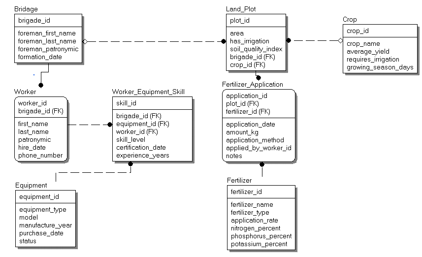

# Практична робота №5: Проектування логічної моделі БД у ERWin

## Предметна область

**Система управління фермерським господарством**

Облік ділянок землі, культур, бригад, працівників, техніки та добрив. Кожну ділянку обслуговує бригада, на ділянці вирощується культура, працівники володіють різною технікою, на ділянки вносяться добрива.

---

## Структура БД

### Основні таблиці:
- **BRIGADE** - бригади (brigade_id, foreman_*, formation_date)
- **WORKER** - працівники (worker_id, first_name, last_name, brigade_id)
- **LAND_PLOT** - ділянки (plot_id, area, has_irrigation, brigade_id, crop_id)
- **CROP** - культури (crop_id, crop_name, average_yield, requires_irrigation)
- **EQUIPMENT** - техніка (equipment_id, equipment_type, model, status)
- **FERTILIZER** - добрива (fertilizer_id, fertilizer_name, nitrogen_%, phosphorus_%, potassium_%)

### Асоціативні таблиці:
- **WORKER_EQUIPMENT_SKILL** - навички працівників (M:N між WORKER і EQUIPMENT)
- **FERTILIZER_APPLICATION** - історія внесення добрив (M:N між LAND_PLOT і FERTILIZER)

---

## Ітерації розробки

| Ітерація | Опис | Результат |
|----------|------|-----------|
| 1 | Виділення сутностей | 6 основних сутностей |
| 2 | Додавання атрибутів | 50+ атрибутів з типами даних |
| 3 | Створення зв'язків | 3 зв'язки (1:N) |
| 4 | Асоціативні сутності | 2 таблиці для M:N зв'язків |
| 5 | Рекурсивні зв'язки | Не потрібні |
| 6 | Приведення до 1NF | Атомарні атрибути |
| 7 | Приведення до 2NF | Немає часткових залежностей |
| 8 | Приведення до 3NF | Мінімізовані транзитивні залежності |

---

## Фінальна модель



**Характеристики:**
- 8 таблиць
- 10 зв'язків
- Повна відповідність 3NF
- Підтримка всіх запитів з постановки задачі

---

## Переваги

-  Нормалізація до 3NF
-  Відсутність надлишковості
-  Цілісність через FK
-  Масштабованість
-  Підтримка історичності (через FERTILIZER_APPLICATION)

---

##  Приклади запитів

```sql
-- Площа під культури
SELECT crop_name, SUM(area) 
FROM CROP 
JOIN LAND_PLOT ON CROP.crop_id = LAND_PLOT.crop_id 
GROUP BY crop_name;

-- Працівники з технікою
SELECT worker.last_name, equipment.equipment_type, skill_level
FROM WORKER
JOIN WORKER_EQUIPMENT_SKILL ON worker.worker_id = WORKER_EQUIPMENT_SKILL.worker_id
JOIN EQUIPMENT ON WORKER_EQUIPMENT_SKILL.equipment_id = equipment.equipment_id;

-- Культура з макс. врожайністю
SELECT crop_name, average_yield 
FROM CROP 
WHERE average_yield = (SELECT MAX(average_yield) FROM CROP);
```

---

##  Файли

```
Practice_5/
├── Farm_Management.erwin          # ERWin модель
├── iteration8_3NF_final.png       #ER-діаграма - фінальна модель
└── README.md
```

---

## Автор

**Шевченко А.А.**  
КС-21, ХНУ ім. В.Н. Каразіна  
2025

---

## Посилання
- [Конспект лекцій](https://docs.google.com/document/d/1Ugped4A2_HVfekMeNFSazkbyiOyubYB4vJDXcnRIavY/edit?usp=sharing)
