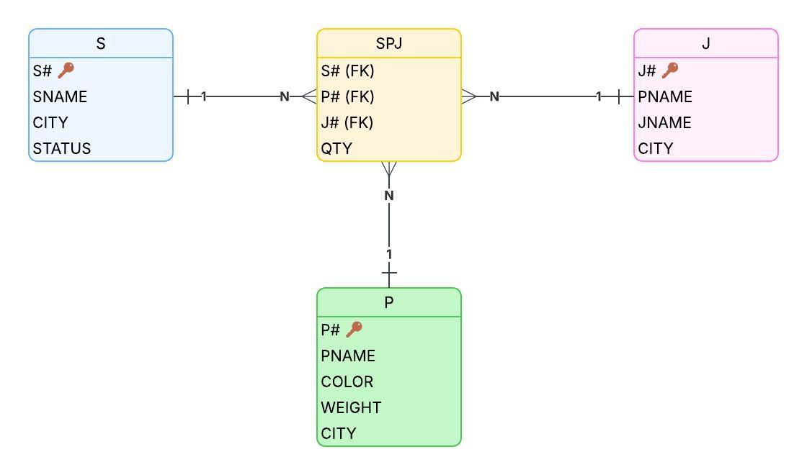

# Практична робота №6: Реляційна алгебра

**Дисципліна:** Бази даних  
**Студент:** Шевченко А.А., група КС-21  
**Спеціальність:** 122 «Комп'ютерні науки»  
**Харківський національний університет імені В.Н. Каразіна**

---

## Мета роботи

Набути досвіду створення запитів у реляційній моделі баз даних, ознайомитися з основними операціями реляційної алгебри та навчитися застосовувати їх для оптимізації запитів і роботи з даними.

---

## Опис предметної області

Система управління постачаннями, яка включає три основні сутності:
- **S (Suppliers)** - Постачальники
- **P (Parts)** - Товари/Деталі
- **J (Projects)** - Проекти
- **SPJ** - Зв'язок постачань (багато-до-багатьох)

### ER-діаграма



**Структура таблиць:**

**S (Постачальники):**
- S# (PK) - номер постачальника
- SNAME - ім'я постачальника
- CITY - місто
- STATUS - статус

**P (Товари):**
- P# (PK) - номер товару
- PNAME - назва товару
- COLOR - колір
- WEIGHT - вага
- CITY - місто

**J (Проекти):**
- J# (PK) - номер проекту
- JNAME - назва проекту
- CITY - місто

**SPJ (Постачання):**
- S# (FK) - номер постачальника
- P# (FK) - номер товару
- J# (FK) - номер проекту
- QTY - кількість

---

## Завдання (Варіант 15)

### 1. Отримати повну інформацію про всі проекти в Дніпрі
```
J WHERE CITY='Дніпро'
```

### 2. Отримати всі поєднання "ім'я проекту-місто проекту"
```
J [JNAME, CITY]
```

### 3. Отримати всі імена товарів, ім'я яких складає 5 символів
```
(P WHERE LENGTH(PNAME)=5) [PNAME]
```

### 4. Отримати міста постачальників, статус яких дорівнює 20
```
(S WHERE STATUS=20) [CITY]
```

### 5. Отримати імена постачальників з Харкова
```
(S WHERE CITY='Харків') [SNAME]
```

### 6. Отримати імена товарів та їх вагу, які постачаються постачальниками S2 та Шевченко
```
T1 := (SPJ WHERE S#='S2') [P#]
T2 := (SPJ JOIN (S WHERE SNAME='Шевченко')) [P#]
T3 := T1 UNION T2
T4 := T3 JOIN P
RESULT := T4 [PNAME, WEIGHT]
```

### 7. Отримати імена товару, що постачаються постачальником зі статусом більше 15 та іменем, яке починається на літеру С
```
T1 := S WHERE STATUS>15 AND SNAME LIKE 'С%'
T2 := T1 JOIN SPJ
T3 := T2 JOIN P
RESULT := T3 [PNAME]
```

### 8. Отримати номери проектів, в які постачаються товари з Харкова або постачальником з Харкова
```
T1 := (P WHERE CITY='Харків') JOIN SPJ
T2 := T1 [J#]
T3 := (S WHERE CITY='Харків') JOIN SPJ
T4 := T3 [J#]
RESULT := T2 UNION T4
```

### 9. Отримати імена товарів, які поставляються Шевченко в кількості більше 200
```
T1 := S WHERE SNAME='Шевченко'
T2 := T1 JOIN SPJ
T3 := T2 WHERE QTY>200
T4 := T3 JOIN P
RESULT := T4 [PNAME]
```

---

## Використані операції реляційної алгебри

- **Вибірка (WHERE)** - фільтрація рядків за умовою
- **Проекція ([ ])** - вибір конкретних стовпців
- **З'єднання (JOIN)** - об'єднання таблиць за спільними атрибутами
- **Об'єднання (UNION)** - об'єднання результатів двох запитів

---

## Висновки

При виконанні практичної роботи №6:

1. **Створено структуровану ER-діаграму**, яка чітко визначає взаємозв'язки між сутностями "Постачальники", "Товари" та "Проекти" з усіма необхідними атрибутами та ключами.

2. **Успішно реалізовано 9 запитів реляційною алгеброю**, що охоплюють:
   - Вибірки даних з фільтрацією за містом та статусом
   - Роботу з текстовими даними (довжина імені, пошук за шаблоном)
   - Складні запити з об'єднанням даних з кількох таблиць
   - Аналіз кількісних показників постачань

3. **Застосовано ключові операції реляційної алгебри**: вибірку, проекцію, з'єднання та об'єднання для вирішення практичних завдань.

Робота підтверджує ефективність використання реляційної алгебри для вирішення практичних завдань обробки даних. Отримані результати можуть слугувати основою для подальшого впровадження SQL-запитів у реальній системі управління базами даних.

---

## Додаткові матеріали

- [Конспект/Словник лекцій](https://docs.google.com/document/d/1Ugped4A2_HVfekMeNFSazkbyiOyubYB4vJDXcnRIavY/edit?usp=sharing)

---

## Автор

**Шевченко А.А.**  
Група КС-21, 2 курс  
Кафедра математичного моделювання та аналізу даних  
Харківський національний університет імені В.Н. Каразіна


